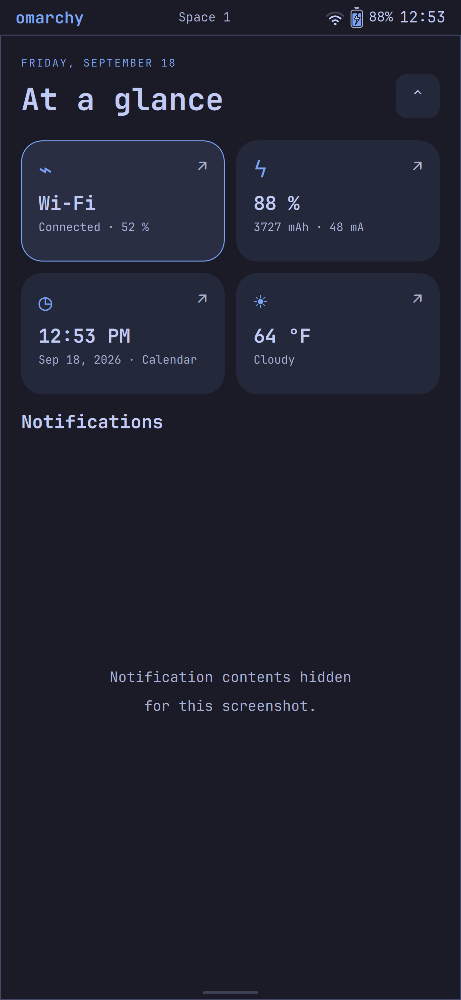
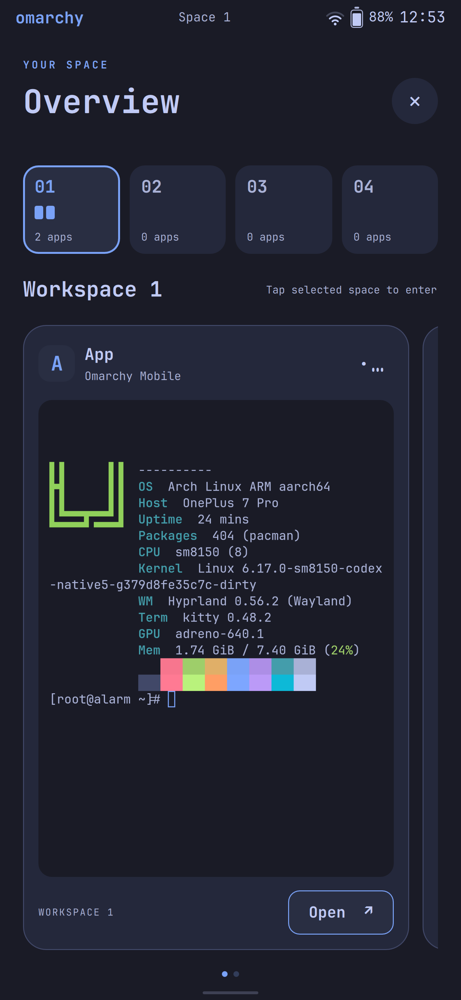

# Omarchy Mobile

The Omarchy desktop experience on Linux phones: Arch Linux ARM, Hyprland, GPU
rendering and a touch-oriented Quickshell interface. One mobile shell and one OS,
brought up handset by handset, with the kernel, firmware and power work for each
phone kept in its own device directory.

**Status: experimental, September 25, 2026.** Two phones are in bring-up. Neither
is a daily phone or a general-purpose installation image yet.

**Project plan and status tracker:** [`plans/`](plans/index.html), with a page per
device, a side-by-side comparison, and the shared software and desktop integration.

## Devices

| Device | SoC | Where it is | Details |
|---|---|---|---|
| OnePlus 7 Pro (`guacamole`) | Snapdragon 855 · Adreno 640 | Boots from internal storage into the full touch shell on the GPU; Wi-Fi, audio, Bluetooth, sensors and the rear cameras work; cellular waits on a SIM | [README](devices/oneplus7pro/README.md) · [status](devices/oneplus7pro/docs/status.md) |
| Pixel 7 Pro (`cheetah`) | Google Tensor G2 · Mali-G710 | Mainline Linux runs the shared shell at 120 Hz with confirmed CRT power-button screen off/on; the Arch root and boot image are installed and verified, while autonomous boot is under diagnosis; full suspend, battery, radios and audio remain unfinished | [README](devices/pixel7pro/README.md) · [status](devices/pixel7pro/docs/status.md) |

## The shared shell

Real captures from the OnePlus 7 Pro. The Pixel 7 Pro runs the same shell source.

<table>
<tr><th>Terminal / Fastfetch</th><th>Notification shade</th><th>Windows / workspaces</th></tr>
<tr>
<td><a href="devices/oneplus7pro/docs/images/terminal.png"></a></td>
<td><a href="devices/oneplus7pro/docs/images/notifications.png"></a></td>
<td><a href="devices/oneplus7pro/docs/images/workspaces.png"></a></td>
</tr>
</table>

Touch controls and the rest of the shell are described in the
[OnePlus 7 Pro README](devices/oneplus7pro/README.md#touch-controls) and
[`overlay/mobile/`](overlay/mobile/README.md).

## Layout

```text
overlay/mobile/          shared Quickshell UI, gestures, themes, settings and helpers
tests/                   shared shell tests (Python backends, QML touch components)
docs/                    project-wide architecture, roadmap, shared-OS plan, publishing
plans/                   the status tracker (static HTML, opens from disk)
devices/<device>/        one bring-up workspace per phone:
  README.md                what works on that phone and how to connect
  adapter/                 files installed into that phone's root: session setup,
                           scale, power, audio and sensor glue
  kernel/                  kernel patches, device-tree overlays, configurations
  scripts/                 host-side build, transfer, guarded boot/flash, diagnostics
  tests/                   hardware-policy checks
  docs/                    status, dated bring-up notes, recovery instructions
  out/  .work/             ignored local build output, firmware and kernel trees
```

Shared shell, input and service policy belongs in `overlay/mobile/`; anything tied
to one phone's hardware belongs in its device directory. See the
[mobile architecture](docs/mobile-architecture.md) and the
[shared OS plan](docs/shared-os-20260925.md), whose `os/`, `packages/` and
`sources.lock` parts are not built yet.

## Working on a device

Run a device's tools from its directory, or by path; each script finds its own
device workspace, and `out/` and `.work/` stay per device:

```sh
cd devices/pixel7pro
python scripts/boot-pixel-shell.py
```

Handset serials, firmware, backups and raw logs are local configuration, never
checked in. Set `PHONE_SERIAL`, or put the serial on one line in the ignored
`devices/<device>/out/device.serial`. Flash helpers keep their image, hash and
slot checks. Device docs describe historical states as well as the current one;
they are not installation instructions for an arbitrary phone.

Shared shell tests need no phone:

```sh
for t in tests/test_*.py; do python3 "$t"; done
tests/run_touch_qml.sh
```

## Foundations and references

- [Omarchy](https://omarchy.org/) — desktop conventions, themes and applications.
- [Arch Linux ARM](https://archlinuxarm.org/) — AArch64 userspace and packages.
- [Omarchy CM5](https://github.com/TensorFleet/omarchy-cm5) — related handheld work.
- Per-device kernel and bring-up references are listed in each device README.

Upstream licenses and attribution remain with the corresponding source files.
Proprietary firmware and device-specific calibration/backups are not included.
Publication rules are in [docs/publishing.md](docs/publishing.md).
