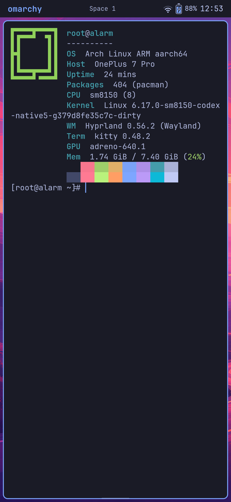
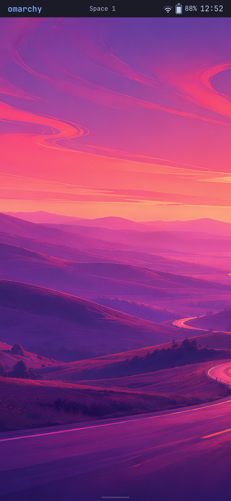
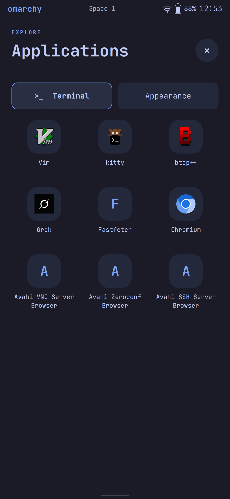
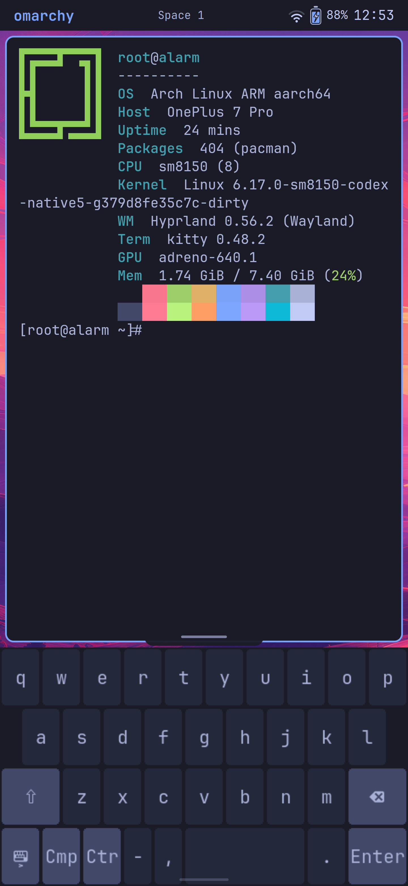

# Omarchy Mobile · OnePlus 7 Pro

An effort to bring the Omarchy desktop experience to a Linux phone: Arch Linux
ARM, Hyprland, GPU rendering, and a touch-oriented Quickshell interface on the
OnePlus 7 Pro (`guacamole`, Snapdragon 855 / Adreno 640).

The aim is a reusable mobile shell with standard Omarchy themes, familiar apps,
and touch controls. Phone-specific kernel, firmware and power work lives
separately from the shell so other devices can eventually use the same interface.

**Status: active hardware bring-up, September 18, 2026.** The phone boots into a
usable touch desktop with native display output, Wi-Fi, charging and sleep/wake.
Audio is being brought up now. This is an experimental port, not yet a daily
phone or a general-purpose installation image.

## On the phone

Real captures from the running phone. Network identity and notification content
are hidden in the shade capture; no demo UI or generated mockups are used.
Click an image to open it.

<table>
<tr><th>Terminal / Fastfetch</th><th>Wallpaper</th><th>Notification shade</th></tr>
<tr>
<td><a href="docs/images/terminal.png"></a></td>
<td><a href="docs/images/wallpaper.png"></a></td>
<td><a href="docs/images/notifications.png"></a></td>
</tr>
<tr><th>App launcher</th><th>Windows / workspaces</th><th>Keyboard</th></tr>
<tr>
<td><a href="docs/images/launcher.png"></a></td>
<td><a href="docs/images/workspaces.png"></a></td>
<td><a href="docs/images/keyboard.png"></a></td>
</tr>
</table>

## What works

| Area | Current result |
|---|---|
| Boot and storage | Persistent Arch Linux ARM installation; tested slot-B boot images and rollback checkpoints. |
| CPU | All eight Snapdragon 855 CPU cores online. |
| GPU | Adreno 640 hardware rendering; Hyprland and Quickshell use the GPU. |
| Display | Native DPU/DSI scanout at **1440 × 3120, 60 Hz**; correct colors and stable output. 90 Hz is not enabled. |
| Touch | Multitouch, including user-tested five-finger input. |
| Wi-Fi | NetworkManager connections, saved-network reconnect, internet access and recovery after wake. |
| USB | USB networking and pinned-key SSH for development; reconnect support. |
| Battery and charging | Gauge readout, charge/current/temperature details and conservative persistent charging. Current policy is **500 mA / 4.20 V**; fast charging is not implemented. |
| Sleep/wake | Power-button display control and tested system suspend/resume with working touch and Wi-Fi afterward. Deepest low-power states remain under investigation. |
| Packages | Normal `pacman` use; the earlier Landlock compatibility issue is fixed. |
| Terminal | Kitty with touch scrolling, JetBrainsMono Nerd Font and Omarchy-branded Fastfetch. |
| Keyboard | On-screen keyboard with gesture activation and a swipe-down dismissal handle. |
| App launcher | Touch launcher, desktop entries and multiple tiled app windows. |
| Window overview | Live previews, workspace selection, focusing apps across workspaces, and moving windows between workspaces. |
| Themes | Omarchy theme colors and wallpapers, wallpaper previews/cycling, and remembered wallpaper choices. |
| Notification shade | Pull-down panel, grouped notifications, heads-up toasts, Wi-Fi/mute/DND toggles, battery details, Wi-Fi picker, calendar, optional weather, and a compact CPU/RAM chip that opens a performance panel. |
| Browser and webapps | Native-Wayland Chromium and a Grok webapp launcher, using a separate browser account with Chromium's sandbox enabled. |

### Audio milestone

The ADSP firmware runs, WCD9340 codec and SLIMbus enumerate, and ALSA exposes
playback/capture. Both TFA9874 amplifiers are identified, with stock-derived
speaker and receiver profiles. Short, quiet channel-isolated playback tests
achieve clock lock and return both amplifiers to power-down afterward.

One initial tone was heard by the user; **independent acoustic confirmation of
both outputs is still pending**. PipeWire application playback and the themed volume slider are installed, with
a fixed conservative output cap while DSP speaker protection is unfinished.
Audio, the volume-key device and the floating panel now start automatically
after reboot. The internal microphone (the stock handset mic) records through
PipeWire and starts with the rest of the audio stack; recordings were confirmed
clean by ear. The other two microphones work but are not exposed yet. Physical
button confirmation and audio suspend validation remain unfinished. YouTube
playback has been reported inaudible;
browser audio and choppy video playback need further diagnosis. See the [audio bring-up notes](docs/audio-bringup-20260918.md).

## Touch controls

- **Swipe up from bottom left:** app launcher.
- **Swipe up from bottom center:** windows and workspaces.
- **Swipe up from bottom right:** keyboard.
- **Swipe down on an open launcher/overview:** close it; the launcher must be at the top of its scroll area.
- **Swipe down from the top bar:** notification shade; swipe up to close.
- **Launcher → Settings:** theme, wallpaper, font, clipboard history and DND.
- **Shade clipboard button (⧉):** local clipboard history; desktop sync is not on.
- **Heads-up toast:** tap to open the shade; swipe up to dismiss the banner only. Do Not Disturb silences toasts.
- **Tap an app preview:** focus that window on its workspace.
- **Tap a workspace:** preview its windows; tap it again to enter it.
- **Drag an app preview to a workspace:** move the window there.
- **Swipe down on the handle above the keyboard:** hide it.
- **Volume keys:** change media volume, or call volume during a call. Tap the
  chevron on the volume panel to show media, ring & notification, call and
  alarm volumes side by side; tap an icon to mute that group.

## Still to do

The [remaining hardware handoff](docs/hardware-plan-20260922.md) records the
current baseline, source references, implementation order and physical tests
for audio, Bluetooth, sensors, cameras, power and the other unfinished devices.

- Complete both speakers, application audio, volume controls, and the second and third microphones.
- Reach deeper idle/suspend states and measure repeatable battery life.
- Implement reliable shutdown; current power-off attempts can reboot instead.
- Bring up Bluetooth, haptics, sensors, GPS and cameras.
- Integrate modem data, SMS and voice. Modem/QMI groundwork exists, but there is
  no tested cellular service, calling or texting yet. See the
  [cellular investigation and implementation plan](docs/cellular-plan-20260922.md)
  for the verified baseline, SIM recommendation and staged implementation gates.
- Move the desktop into a standard user account with sudo. The current bring-up
  session runs as root; Chromium uses a separate restricted account.
- Extend touch window management, notification handling, keyboard prediction,
  preferences and desktop/phone integration.
- Investigate USB-C docking/DisplayPort and higher-power charging.

There is no measured Android-versus-Linux battery-life comparison yet. Working
suspend does not establish that the SoC reaches its deepest sleep states.

## Project layout

```text
overlay/mobile/          reusable Quickshell UI, gestures, themes and helpers
devices/oneplus7pro/     guacamole adapters, device-tree overlays and kernel work
scripts/                build, transfer, guarded flashing and diagnostic tools
tests/                  gesture, backend and hardware-policy checks
docs/                   results, architecture, limitations and experiment history
```

The current bootstrap uses a small initramfs that starts Arch in a chroot.
Desktop session and device helpers account for that environment; standard
systemd service assumptions do not all apply yet.

Start with [current status](docs/status.md), [next-session notes](docs/next-session.md),
the [mobile architecture](docs/mobile-architecture.md), and the
[roadmap](docs/mobile-roadmap.md). Older experiment notes describe historical
states and are not installation instructions for an arbitrary phone.

### Local device configuration

Personal backups, firmware blobs, raw logs, SSH keys and device identifiers are
not distribution assets. Build/test output belongs in ignored `out/` and `.work/`.

Flash helpers require an explicit target identity and retain their image/hash
and slot checks. Set `PHONE_SERIAL` locally, or store the target serial on one
line in ignored `out/device.serial`. USB SSH uses a separately provisioned,
pinned host key; override the client identity with `PHONE_SSH_IDENTITY` if needed.

## Foundations and references

- [Omarchy](https://omarchy.org/) — desktop conventions, themes and applications.
- [Arch Linux ARM](https://archlinuxarm.org/) — AArch64 userspace and packages.
- [postmarketOS SM8150 kernel](https://pkgs.postmarketos.org/package/master/postmarketos/aarch64/linux-postmarketos-qcom-sm8150)
  and [SM8150 mainline work](https://gitlab.com/sm8150-mainline/linux).
- [Robin Snyders' OnePlus 7T Pro bring-up](https://github.com/Sr-0w/hotdog-linux-bringup)
  — related-device research and driver work, including the TFA9874 foundation.
  Guacamole wiring, firmware and hardware revisions are checked separately.
- [Omarchy CM5](https://github.com/TensorFleet/omarchy-cm5) — related handheld work.

Upstream licenses and attribution remain with the corresponding source files.
Proprietary firmware and device-specific calibration/backups are not included.
