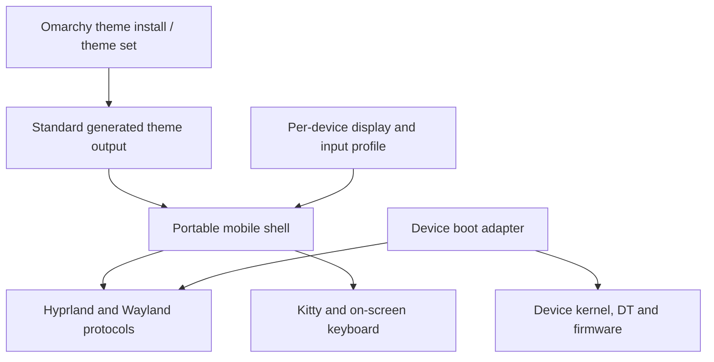

# Portable mobile desktop architecture

The target is a mobile interaction layer for **standard Omarchy on Hyprland**,
with device enablement kept separate. It is not a replacement distribution or
a second theme ecosystem. The current handset still boots a minimal Arch
chroot from BusyBox, so it needs a temporary device adapter.

## Code ownership

| Layer | Location | Responsibilities |
|---|---|---|
| Shared mobile userspace | `overlay/mobile/` | Touch navigation, app entries, window cards, keyboard control, theme adapter, Kitty/Fastfetch setup |
| Device profile | `devices/<device>/mobile.json` | Display scale, keyboard geometry, optional device/session defaults |
| Device session adapter | `devices/<device>/desktop-prepare.sh` and bootstrap QML | Temporary startup requirements; OnePlus chroot and root paths stay here |
| Device kernel enablement | `devices/oneplus7pro/kernel/touch/` | Touch wiring, power rails, device-tree overlay and matched driver patches |
| Shared kernel fixes | `kernel/patches/` | Upstream fixes such as the MSM imported dma-buf lifetime correction |
| Existing hardware build/flash tools | `scripts/*touch*`, `scripts/*cpu*`, `scripts/*gpu*`, `scripts/initramfs/` | Explicitly OnePlus bring-up tooling; never required by the portable shell |

The existing boot tools retain their names to preserve recovery commands.
`build_touch_test.sh` now reads touch sources from the device directory. The
relocated overlay produces byte-identical DTBO output. No kernel code or
flashed image changed during this organization work.

## Portable interfaces

- Use XDG config/state/data paths and the session's user, runtime directory,
  Wayland display and Hyprland instance. Shared UI does not assume root, a USB
  address, a phone serial, a framebuffer address or a particular input device.
- Use Wayland layer-shell, virtual-keyboard and input-method protocols. Do not
  intercept raw evdev globally to implement navigation.
- Edge swipes belong to the shell's 24-pixel navigation surface. Apps retain their
  own touch gestures. Global compositor gestures are a separate future task.
- Applications come from desktop entries. Their parsed argv is executed
  directly; terminal entries are wrapped in Kitty.
- Window operations use the current Hyprland Lua dispatchers. Window capture
  uses Quickshell's `ScreencopyView` and Hyprland's toplevel export protocol.
- Keyboard automatic show/hide depends on text-input events from applications.
  Manual show/hide remains available for unsupported or imperfect clients.

## Omarchy theme compatibility

The theme bridge reads Omarchy's standard `colors.toml`, including both the
current semantic names and earlier `color0`–`color15` palettes. It prefers
`$XDG_STATE_HOME/omarchy/current/theme/colors.toml` and supports the older
`$XDG_CONFIG_HOME/omarchy/current/theme/colors.toml` location. On a full Omarchy
installation, selecting a theme delegates to `omarchy theme set NAME`.

On this minimal Arch installation only, bundled standard Omarchy palettes
provide a temporary picker. Selection lives in **omarchy-mobile's own state**;
it does not impersonate or overwrite Omarchy's current-theme directory. The
bridge themes the mobile shell, keyboard, Hyprland borders and Kitty. It
now also applies standard theme wallpapers through a shared background layer.
GTK/icon packs and every Omarchy application theme remain future work.
An optional trusted `~/.config/omarchy-mobile/wallpaper-apply` adapter receives
the chosen image path; OnePlus uses it to align the frozen initramfs fallback.
This hook is separate from theme repositories.
Wallpaper choices on minimal Arch live in mobile-owned `backgrounds.json`;
full Omarchy current-background state remains authoritative.
[Wallpaper implementation and validation](wallpaper-switching-20260917.md).

[Archwave](https://github.com/davidguttman/archwave) is a real compatibility
target, not a request to invent another format. It currently ships the older
`alacritty.toml` palette. Omarchy's own `omarchy-theme-colors-from-alacritty`
successfully converted it during this work; the resulting background and
accent were checked against the adapter. Its theme-provided Lua/configuration
was not executed. Archwave has not been installed or selected on the phone.

The eventual **Appearance → Install theme → repository URL** flow should call
Omarchy's actual theme installation machinery, display progress/errors, and
refresh the picker. Reuse its conversion, staging, icon and wallpaper handling
rather than building a competing repository installer. Wallpaper switching
is now implemented in Appearance; full repository installation remains future work.

## Another phone

1. Bring up that phone's Linux display, GPU and input independently.
2. Provide a normal Arch/Omarchy user session with Hyprland, Quickshell, Kitty,
   Python 3.11+ and wvkbd with input-method-v2 support.
3. Add `devices/<device>/mobile.json`; no board code belongs in the QML shell.
4. Add a session adapter only if the device cannot yet use normal session
   startup. A standard session just sources `~/.config/hypr/mobile.lua` and
   starts `omarchy-mobile-session launch` instead of another navigation shell.
5. Validate scaling, touch coordinates, virtual keyboard, theme changes,
   lifecycle/power behavior and recovery on that hardware. Only the OnePlus
   7 Pro has been tested so far.

## Remaining milestones

- Standard user/session management and full Omarchy package integration.
- Repository theme install UI and complete icon/application theming.
- More window gestures, drag/reorder, rotation and accessibility preferences.
- Power, battery/charging, brightness, sleep/wake and screen lock.
- Wi-Fi and other hardware support, owned by each device port.
- Packaged installation/update/rollback of the shared layer with explicit
  supported Hyprland/Quickshell versions. Current target: Hyprland 0.56 Lua,
  Quickshell 0.3, Qt 6.11; other versions are untested.

## Shared touch motion and window management

Drawer tracking/settling and preview gesture recognition live in the shared
QML shell, using logical coordinates and standard Qt touch ownership. The
OnePlus adapter supplies no gesture-specific implementation. Overview holds
expose workspace move, window swap and normal-close targets; app content keeps
its native gestures outside the overview. See
[touch implementation and validation](touch-drawers-20260917.md).
