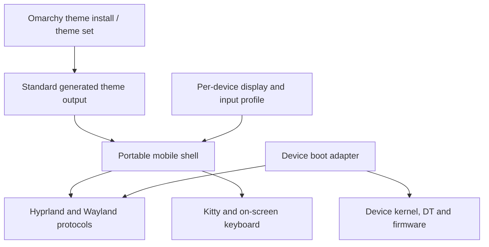

# Portable mobile desktop architecture

The target is a mobile interaction layer for **standard Omarchy on Hyprland**,
with device enablement kept separate. It is not a replacement distribution or
a second theme ecosystem. The current handset still boots a minimal Arch
chroot from BusyBox, so it needs a temporary device adapter.



## Code ownership

| Layer | Location | Responsibilities |
|---|---|---|
| Shared mobile userspace | `overlay/mobile/` | Touch navigation, app entries, window cards, keyboard control, theme adapter, Kitty/Fastfetch setup |
| Device profile | `devices/<device>/mobile.json` | Display scale, keyboard geometry, optional device/session defaults |
| Device session adapter | `devices/<device>/desktop-prepare.sh` and bootstrap QML | Temporary startup requirements; OnePlus chroot and root paths stay here |
| Device kernel enablement | `devices/oneplus7pro/kernel/touch/` | Touch wiring, power rails, device-tree overlay and matched driver patches |
| Shared kernel fixes | `kernel/patches/` | Upstream fixes such as the MSM imported dma-buf lifetime correction |
| Existing hardware build/flash tools | `scripts/*touch*`, `scripts/*cpu*`, `scripts/*gpu*`, `scripts/initramfs/` | Explicitly OnePlus bring-up tooling; never required by the portable shell |

The existing boot tools retain their names to preserve recovery commands.
`build_touch_test.sh` now reads touch sources from the device directory. The
relocated overlay produces byte-identical DTBO output. No kernel code or
flashed image changed during this organization work.

## Portable interfaces

- Use XDG config/state/data paths and the session's user, runtime directory,
  Wayland display and Hyprland instance. Shared UI does not assume root, a USB
  address, a phone serial, a framebuffer address or a particular input device.
- Use Wayland layer-shell, virtual-keyboard and input-method protocols. Do not
  intercept raw evdev globally to implement navigation.
- Edge swipes belong to the shell's 24-pixel navigation surface. Apps retain their
  own touch gestures. Global compositor gestures are a separate future task.
- Applications come from desktop entries. Their parsed argv is executed
  directly; terminal entries are wrapped in Kitty.
- Window operations use the current Hyprland Lua dispatchers. Window capture
  uses Quickshell's `ScreencopyView` and Hyprland's toplevel export protocol.
- Keyboard automatic show/hide depends on text-input events from applications.
  Manual show/hide remains available for unsupported or imperfect clients.

## Omarchy theme compatibility

The theme bridge reads Omarchy's standard `colors.toml`, including both the
current semantic names and earlier `color0`–`color15` palettes. It prefers
`$XDG_STATE_HOME/omarchy/current/theme/colors.toml` and supports the older
`$XDG_CONFIG_HOME/omarchy/current/theme/colors.toml` location. On a full Omarchy
installation, selecting a theme delegates to `omarchy theme set NAME`.

On this minimal Arch installation only, bundled standard Omarchy palettes
provide a temporary picker. Selection lives in **omarchy-mobile's own state**;
it does not impersonate or overwrite Omarchy's current-theme directory. The
bridge themes the mobile shell, keyboard, Hyprland borders and Kitty. It
now also applies standard theme wallpapers through a shared background layer.
GTK/icon packs and every Omarchy application theme remain future work.
An optional trusted `~/.config/omarchy-mobile/wallpaper-apply` adapter receives
the chosen image path; OnePlus uses it to align the frozen initramfs fallback.
This hook is separate from theme repositories.
Wallpaper choices on minimal Arch live in mobile-owned `backgrounds.json`;
full Omarchy current-background state remains authoritative.
[Wallpaper implementation and validation](../devices/oneplus7pro/docs/wallpaper-switching-20260917.md).

[Archwave](https://github.com/davidguttman/archwave) is a real compatibility
target, not a request to invent another format. It currently ships the older
`alacritty.toml` palette. Omarchy's own `omarchy-theme-colors-from-alacritty`
successfully converted it during this work; the resulting background and
accent were checked against the adapter. Its theme-provided Lua/configuration
was not executed. Archwave has not been installed or selected on the phone.

The **Appearance → Install theme** flow lists https://omarchy.us/themes and
also accepts a pasted GitHub URL. Both go through
`omarchy-mobile-theme-install`. When `omarchy theme install` is on PATH it
is the installer; otherwise the helper uses that command's URL check, theme
name and `~/.config/omarchy/themes` clone, then applies the palette. A future
pairing daemon should call `url` or `name` on that helper when a desktop
installs a theme. Do not add a second clone path.

## Another phone

1. Bring up that phone's Linux display, GPU and input independently.
2. Provide a normal Arch/Omarchy user session with Hyprland, Quickshell, Kitty,
   Python 3.11+ and wvkbd with input-method-v2 support.
3. Add `devices/<device>/mobile.json`; no board code belongs in the QML shell.
4. Add a session adapter only if the device cannot yet use normal session
   startup. A standard session just sources `~/.config/hypr/mobile.lua` and
   starts `omarchy-mobile-session launch` instead of another navigation shell.
5. Validate scaling, touch coordinates, virtual keyboard, theme changes,
   lifecycle/power behavior and recovery on that hardware. Only the OnePlus
   7 Pro has been tested so far.

## Settings, apps and clipboard

Settings is a normal app (`omarchy-mobile-settings`), not a shell panel. It
imports the shared `OmarchyMobile` QML module for theme and widgets. Privileged
changes go through the existing helpers (`omarchy-mobile-theme`, prefs, wifi,
volume, clipboard). The shade remains another client of those helpers.

## Apps

A new app is a directory under `overlay/mobile/apps/<id>/`. Settings is not
one of these. It stays a first-party client of the privileged helpers.

```
overlay/mobile/apps/<id>/
  manifest.json    id, name, comment, icon, permissions
  shell.qml        Quickshell window, root ShellRoot, one AppWindow
  <name>.desktop   Exec=omarchy-mobile-app launch <id>
```

`install.sh` copies the manifest to
`$XDG_DATA_HOME/omarchy-mobile/apps/<id>/manifest.json`, the window to
`$XDG_CONFIG_HOME/quickshell/omarchy-mobile-apps/<id>/shell.qml`, and the
desktop entry to `$XDG_DATA_HOME/applications/`. The launcher does not install
anything. It only starts what is already installed.

Quickshell hot-reloads when a loaded QML file is modified in place. `install`
replaces files instead, which the running shell does not notice, so after
`install.sh` either rewrite the changed file in place or restart the shell
through `omarchy-mobile-session launch`.

`manifest.json` fields:

| Field | Required | Meaning |
|---|---|---|
| `id` | yes | Same as the directory name. No slashes. |
| `name` | yes | Drawer label and window title source. |
| `comment` | no | Desktop entry comment. |
| `icon` | no | Icon name from the current theme. |
| `permissions` | yes | List of names from `PERMISSIONS` in `overlay/mobile/app.py`. An unknown name is refused. |

The permission list today is only `files.home`: read and change the home
folder, including Desktop, Documents, Downloads, Music, Pictures, and Videos
when those directories exist. Adding a permission means adding it to
`PERMISSIONS` and enforcing it in the helper that does the work. An app cannot
invent a name and have it mean something.

Grants are `$XDG_STATE_HOME/omarchy-mobile/grants/<id>.json`, a map of
permission name to `true`. The first window shows `GrantPage` until every
requested permission is granted. `Don't allow` closes the app.

```bash
omarchy-mobile-app status <id>
omarchy-mobile-app grant <id> <permission>
omarchy-mobile-app launch <id>
```

`launch` requires a Wayland session. It sets `QML_IMPORT_PATH` to the
OmarchyMobile module, `QT_IM_MODULE=none`, and `OMARCHY_MOBILE_APP`. If that
app's window is already open, launch replaces it. It does not kill the shell
or Settings.

`AppWindow` (`overlay/mobile/kit/AppWindow.qml`) is the page chrome: theme
background, kicker, heading, optional back, and quit when the window closes.
The app's own pages are its children. `GrantPage` renders the requested
permissions and emits `allowed` or `denied`.

The left-edge gesture is not special to Settings. The shell writes a new
stamp to `$XDG_RUNTIME_DIR/omarchy-mobile/back`. `AppBack`, included by
`AppWindow`, watches that file and emits the window's `backClicked` when
this app's process owns the window on screen. The window's `appTitle` stays
stable so a changing page heading does not hide the app from that check.
An app handles the header button and the gesture with the same
`onBackClicked`. Settings uses `AppBack` directly because it is not an
`AppWindow`.

Appearance → Corners writes `corners` in the mobile preferences. Theme sync
reads that first, then Omarchy's toggle and `looknfeel.lua`. `MobileTheme.radius`
is what the app drawer icons, shade cards, buttons, and app pages use, and
Hyprland's window rounding is set to the same choice. The status bar is a
full-width strip, so it has no outer corner to round; its glyphs stay icons.

Corners follow Omarchy. An active `rounding` value in
`~/.config/hypr/looknfeel.lua`, or the Style > Corners toggle file under
`~/.local/state/omarchy/toggles/hypr/`, chooses the radius. `0` is square.
A commented line is ignored, and the toggle wins over looknfeel. Until one
of those is set, the shell keeps its current radius. Theme sync publishes
`corners` and `radius` and sets Hyprland's window rounding to the same
number. Shared widgets and app pages use `MobileTheme.radius(size)`, which
is `0` when the choice is square and `size` when it is round.

A helper that touches user data checks `has_grant` before doing the work.
Files (`overlay/mobile/files.py`) resolves every path and rejects anything
outside the granted roots. A symlink that points out of those roots is left
out of the listing and cannot be opened, created, moved, copied, or deleted.
Hidden names stay hidden until the user asks for them. The home folder itself
cannot be renamed or deleted, and a folder cannot be placed inside itself.

This is not a process sandbox and not a separate user. The session user can
still run other programs. The grant only binds helpers that agree to check it.
A later sandbox should wrap `omarchy-mobile-app launch` without changing the
manifest. Contacts, location, camera, and notifications are not permissions yet.

## Volume groups

Volume follows Android: media, ring & notifications, calls and alarms each
have their own volume. `wireplumber/30-mobile-volume-groups.conf` creates one
WirePlumber role loopback sink per group; a stream reaches its group by
`media.role` (Music/Movie/Game, Notification/Ringtone, Communication/Phone,
Alarm/Alert), and a stream without a role counts as media. The loopbacks
feed the default sink, which stays at 100% so board limits below it are the
only fixed attenuation. A call pauses media; notifications and alarms duck
it. WirePlumber stores each group's volume across restarts.

WirePlumber publishes `current.role-based.volume.control`: the highest
priority group that is playing, otherwise media. `omarchy-mobile-volume
up|down|mute` follows it, so the keys change call volume during a call.
`set PERCENT [GROUP]` defaults to media. Status keeps the old top-level
`percent` and `muted` for media and adds `groups`, `keys` and `changed`.
Without the loopbacks, media uses the default sink and the other groups
report unavailable. A board that describes its own sink should give it a
`priority.session`, so a loopback never becomes the default sink.

The volume panel shows the group the keys changed; its chevron expands to
all four sliders, each with a tap-to-mute icon.

Clipboard history is a JSON store with stable records (`id`, `created`,
`origin`, `mime`, `text`, `pinned`). Presentation is QML; a future pairing
daemon should read and write the same store, opt-in, without replacing the UI.

## Remaining milestones

- Standard user/session management and full Omarchy package integration.
- Icon packs and application theming. Theme repository install uses the shared helper.
- More window gestures, drag/reorder, rotation and accessibility preferences.
- Power, battery/charging, brightness, sleep/wake and screen lock.
- Wi-Fi and other hardware support, owned by each device port.
- Packaged installation/update/rollback of the shared layer with explicit
  supported Hyprland/Quickshell versions. Current target: Hyprland 0.56 Lua,
  Quickshell 0.3, Qt 6.11; other versions are untested.

## Shared touch motion and window management

Drawer tracking/settling and preview gesture recognition live in the shared
QML shell, using logical coordinates and standard Qt touch ownership. The
OnePlus adapter supplies no gesture-specific implementation. Overview holds
expose workspace move, window swap and normal-close targets; app content keeps
its native gestures outside the overview. See
[touch implementation and validation](../devices/oneplus7pro/docs/touch-drawers-20260917.md).
