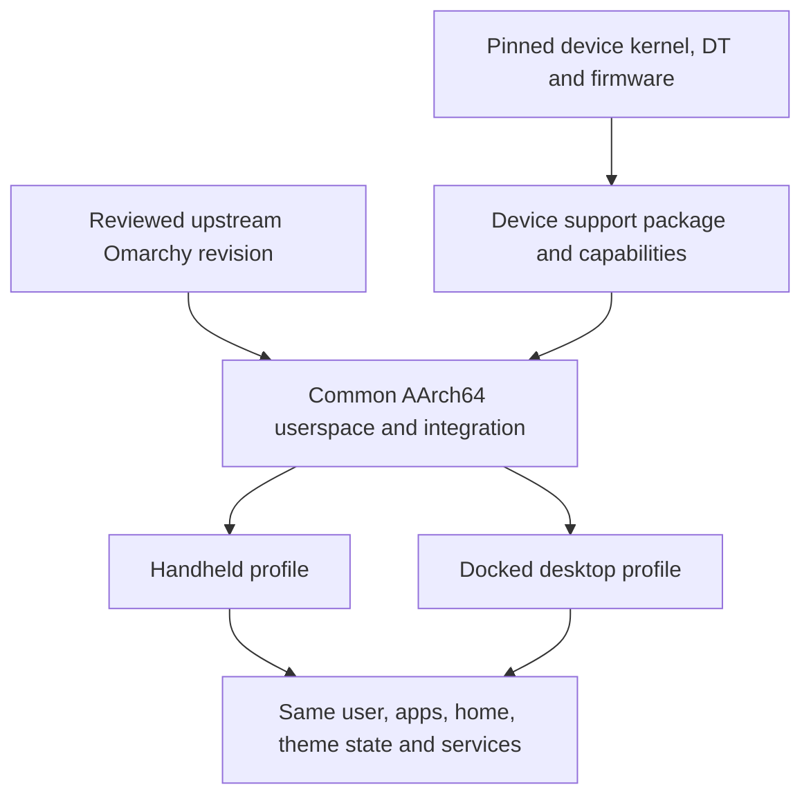

# Shared OS and device repositories — September 25, 2026

Status: monorepo direction accepted by the user on September 25 and carried out
the same day in `omarchy-mobile`: the OnePlus repository became the monorepo
(its history preserved), the OnePlus workspace moved to `devices/oneplus7pro/`
and the Pixel workspace was imported into `devices/pixel7pro/`. Each device
directory keeps the shape its standalone repository had (`adapter/`, `kernel/`,
`scripts/`, `docs/`, ignored `out/` and `.work/`); the shared shell stays in
`overlay/mobile/`. The `os/`, `packages/` and `sources.lock` parts of the layout
below are not built yet. Requested while resuming Pixel work alongside the
existing port.

## Recommendation

Use one product/source monorepo, tentatively `omarchy-mobile`, for the common OS
composition, mobile interface, docking policy, tests and device definitions.
Keep large upstream/vendor kernel trees or necessary kernel forks separate,
referenced by exact commits in device manifests. Do not clone the OS into each
phone repository. Produce separate device boot images and support packages from
a shared AArch64 userspace definition.

The OnePlus project already has `overlay/mobile/`, `devices/oneplus7pro/`, a
portable-mobile architecture document, a common theme adapter and device
profiles. Evolve that boundary rather than creating a second implementation in
the Pixel project. The Pixel repo can remain the bring-up workspace during this
transition; its tested patches, recipes and dated evidence later move under the
shared product tree without carrying local backups into publication.

## Why this arrangement

| Choice | Tradeoff |
|---|---|
| Complete OS repo per phone | Easy initial experiments; duplicated fixes, configuration and update behavior drift immediately. Avoid as the product structure. |
| Shared OS repo plus independent device repos | Valid when independent maintainers/release cadences justify it; every shared/device change requires coordinated versions and CI. More overhead for the current two-device project. |
| Shared monorepo plus device directories | Recommended now: one change can update the common API, both device profiles and tests together. Releases still produce separate device images. |

Separate kernel source repositories are compatible with the monorepo approach.
They hold large source histories, not independent copies of the desktop OS.
Firmware with redistribution restrictions and personal calibration remain local
inputs; manifests specify required sources and checksums.

## Proposed layout

```text
omarchy-mobile/
  os/
    base/                    AArch64 package sets, users, services, image recipe
    omarchy/                 pinned upstream integration and compatibility patches
    profiles/                handheld, docked and development defaults
  overlay/mobile/            existing shared shell, apps, gestures and settings
  packages/                  recipes for shared components and support packages
  devices/
    oneplus7pro/             manifest, boot recipe, kernel config/patches, adapters
    pixel7pro/               manifest, boot recipe, kernel config/patches, adapters
  sources.lock               upstream revisions and immutable download hashes
  tests/
    shared/                  common behavior without hardware
    devices/                 per-device boot/hardware checks
    docking/                 monitor/input transitions and undock recovery
  docs/
    architecture/
    devices/<device>/        current status, dated milestones, recovery instructions
```

This is a suggested eventual layout, not a reason to move working recovery
commands abruptly. Preserve wrappers/links while paths change.

## Dependency boundary



The shared shell should consume normal Linux interfaces first: DRM/KMS and
libinput for display/input, NetworkManager for connectivity, PipeWire for audio,
BlueZ for Bluetooth, and suitable power/sensor/modem services as each becomes
available. Hardware-specific sysfs paths, regulator sequencing, camera tuning,
boot formats, serial identities and framebuffer addresses belong in device
support. Keep temporary bring-up adapters explicit and replaceable.

A device manifest should identify its architecture, kernel source/commit/config,
patch set, firmware inputs, boot packaging, recovery procedure, support packages
and capabilities. Capabilities need states such as verified, experimental and
unavailable. Different GPUs/kernels can require different support packages or
library constraints; identical OS policy does not mean forcing identical driver
binaries onto every phone.

Version the interface between shared userspace and device adapters. A product
release records the common userspace revision and the exact tested device
support revisions. Test that combination per device rather than assuming a
shared shell build proves the hardware works.

## Docking is a session mode, not another installation

Start with one user session/compositor and one set of installed apps. When a
usable external output plus input devices appears, apply desktop layout, scale,
keyboard bindings and workspace policy to that output. The internal screen can
keep the handheld interface, become a secondary display, or switch off according
to policy. On undock, bring windows/focus back to an available display.

Own panel surfaces per output: avoid starting two competing navigation shells,
notification daemons or global shortcut managers. Dock events should query actual
DRM/input capabilities, not just USB cable presence. A separate compositor or
seat is a later option only if real simultaneous-user/isolation requirements
justify its app/window and input-routing complexity. A VM/second rootfs is not
needed merely to show an Omarchy-like desktop on an external screen.

Wired display support is a device capability gate. Google documents its normal
wired projection feature for Pixel 8 and later; that does not establish a working
Pixel 7 Pro DisplayPort path under native Linux. Verify routing/PHY/output support
before promising USB-C monitor docking. Alternative USB-display or wireless
transports would have separate driver/performance work. USB Ethernet success
alone does not establish external-video support.

The user confirmed that wired display output is not a Pixel 7 Pro requirement.
Implement docking in the shared OS for capable devices, including the OnePlus
and future ports; do not make Pixel wired-video work a prerequisite for the OS.

## Keeping close to upstream Omarchy

1. Treat upstream Omarchy as a versioned input, not a pile of copied files or an
   unreviewed rolling installer executed on phones. Pin a tested commit/release.
2. Keep our changes as packages, supported extension/configuration layers, and
   a small documented patch set. Each patch should explain its purpose and
   removal/upstreaming condition.
3. Maintain one AArch64 compatibility layer: package substitutions, unavailable
   applications and installer assumptions are shared concerns, not per-phone UI
   forks. The existing OnePlus chroot/minimal-session workaround is temporary
   device/bootstrap support, not the desired general OS lifecycle.
4. Keep themes, app configuration and user data authoritative in one place across
   handheld/docked profiles. Reuse Omarchy's theme/update interfaces where they
   work; avoid a second independent desktop configuration tree.
5. Update through a compatibility branch: review upstream changes, rebuild shared
   packages, test desktop/handheld/docking behavior and both device combinations,
   then promote. Record known differences and pending support explicitly.
6. Classify migrations: common user-session changes versus device boot/kernel
   changes. Desktop installers must not overwrite phone-specific boot or recovery
   arrangements. Users' personal configuration remains separate from defaults.

Convergence means sharing tested upstream behavior and keeping our differences
visible. It does not mean every desktop package or x86 boot assumption can be
used unchanged on AArch64 phone hardware.

## Public repository transition

The existing OnePlus local `github` remote points to
`https://github.com/Cube-Oakley/omarchy-oneplus7pro.git`. Its publication notes
state that GitHub main comes from a clean public branch, intentionally separate
from private bring-up ancestry. Preserve that clean public lineage. Do not merge
or mirror private history into it when consolidating the Pixel work.

Suggested sequence:

1. Agree on the shared architecture/name, retaining current repositories as
   working checkpoints.
2. Develop common packaging and device contracts on the clean public lineage;
   import reviewed Pixel source/recipes/docs into `devices/pixel7pro/`.
3. Test both existing device builds and their recovery paths before changing
   public paths or release names.
4. Rename the existing public repository to the chosen general name once ready,
   keeping its public history/issues/stars. Update remotes, badges, documentation,
   CI and Pages URLs. Keep device-specific landing pages and release artifacts.
5. Keep former device workspaces as local build checkouts or archive their public
   role once the shared repository is authoritative.

GitHub redirects normal repository URLs and Git operations after a rename, but
project-site URLs are an exception; hosted Actions also need explicit migration.
The current OnePlus publication uses GitHub Pages, so review those paths as part
of a rename. No rename, publish, push or history rewrite was performed here.

## Sources and local evidence

- Existing OnePlus `docs/mobile-architecture.md`, `docs/publishing.md`, README,
  `overlay/mobile/` and `devices/oneplus7pro/` were inspected read-only.
- [Upstream Omarchy](https://github.com/omacom/omarchy): current source separates
  shell, configuration, defaults, install scripts, migrations and themes.
- [GitHub repository rename behavior](https://docs.github.com/en/repositories/creating-and-managing-repositories/renaming-a-repository).
- [Google wired projection support](https://support.google.com/pixelphone/answer/2865484?hl=en).
